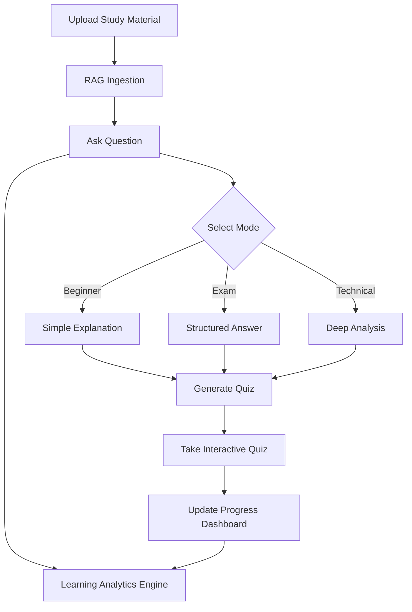
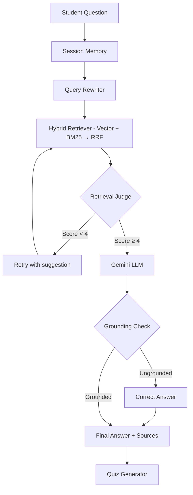

# StudySync AI — Academic Intelligence Platform

A state-of-the-art **Hybrid & Agentic RAG** (Retrieval-Augmented Generation) platform for academic excellence. Upload course materials, extract textbook equations with OCR, ask questions with instant grounded answers, test your knowledge with interactive quizzes, and monitor study focus.

Powered by Google Gemini, Fast Direct RAG, hybrid BM25 + vector search, and a modern Gemini-inspired dark mode interface with glassmorphism.

---

## 🌟 Features & Tech Stack

### 1. Document Ingestion & OCR
Automatically extract text from native PDFs and scanned images.
- **Tech Stack**: FastAPI, `pypdf`, `pdf2image` (Poppler), **Tesseract OCR**, OpenCV, Pillow.
- **Capabilities**: Adaptive thresholding, deskewing, and noise reduction for low-quality scans.

### 2. Agentic RAG Pipeline
Ask questions against your uploaded materials with intelligent multi-stage retrieval and hallucination-free answers.
- **Tech Stack**: **ChromaDB** (Vector Store), **BM25** (Keyword Search), `sentence-transformers/all-MiniLM-L6-v2` (Embeddings), **Gemini API** (LLM/Agent), LangChain.
- **Agent Capabilities**:
    - **Hybrid Retrieval**: Vector similarity + BM25 keyword search fused via Reciprocal Rank Fusion (RRF).
    - **Query Rewriting**: LLM expands vague questions and decomposes multi-part queries.
    - **Retrieval Judge**: Evaluates retrieved context quality and retries with better queries if insufficient.
    - **Conversation Memory**: Session-scoped memory resolves follow-up references (e.g., "What about its complexity?").
    - **Grounding Verification**: Post-generation check ensures every claim is supported by source material.

### 3. Smart Explanation Modes
Adapt the AI's teaching style to your current needs.
- **Tech Stack**: Gemini API, Custom Prompt Engineering (`prompt_modes.py`).
- **Modes**:
    - **Beginner**: Simple language and real-life analogies.
    - **Exam**: Structured, academic responses with bullet points.
    - **Technical**: In-depth analysis with advanced terminology and LaTeX.

### 4. Interactive Quiz Generation
Test your knowledge with auto-generated assessments.
- **Tech Stack**: Gemini API (Structured JSON), Vanilla JS (Interactive UI).
- **Types**: MCQs, True/False, and Short Answer questions with instant feedback and explanations.

### 5. Learning Progress Dashboard
Visualize your academic growth and topic mastery.
- **Tech Stack**: Local JSON-based analytics (`progress_tracker.py`), CSS Grid/Flexbox (Visualization).
- **Metrics**: Topic mastery bars, quiz score averages, and engagement timelines.

### 6. Attention Monitoring
Track engagement during study sessions via webcam.
- **Tech Stack**: **OpenCV** (Haar Cascade face detection), Browser MediaDevices API.
- **Output**: Real-time attention scores and session engagement reports.

---

## 🛠️ Overall Tech Stack Summary

| Layer | Technology |
|---|---|
| **Backend** | FastAPI, Uvicorn |
| **LLM / Agent** | Google Gemini (Multi-model fallback) |
| **Embeddings** | HuggingFace `all-MiniLM-L6-v2` |
| **Vector Store** | ChromaDB |
| **Keyword Search** | BM25 (rank_bm25) |
| **Retrieval Fusion** | Reciprocal Rank Fusion (RRF) |
| **OCR** | Tesseract + OpenCV |
| **PDF Processing** | pypdf + pdf2image |
| **Analytics** | Local JSON File Storage |
| **Frontend** | HTML5, CSS3 (Vanilla), JS (ES6+), MathJax, Marked.js |

---

## 📐 Architecture

### Smart Learning Flow


### Agentic RAG Pipeline


---

## 🚀 Getting Started

### Installation
1. **Clone & Setup Environment**:
   ```bash
   git clone <repo-url>
   cd AI_TEACHING_ASSISTANT-main
   python -m venv .venv
   source .venv/bin/activate  # Windows: .venv\Scripts\activate
   pip install -r requirements.txt
   ```

2. **Configure Environment Variables**:
   Copy `.env.example` to `.env` and add your `GEMINI_API_KEYS`.

3. **External Dependencies**:
   - Install **Tesseract OCR** for image text extraction.
   - Install **Poppler** for scanned PDF processing.

### Running the Platform
```bash
python run.py
```
Access the UI at: `http://127.0.0.1:8000/static/index.html`

---

## 🧪 Testing
The project includes a comprehensive suite of 28 unit and integration tests.
```bash
python -m pytest tests/ -v
```

---

## 📝 License
Developed as part of a Final Year Project (FYP).
