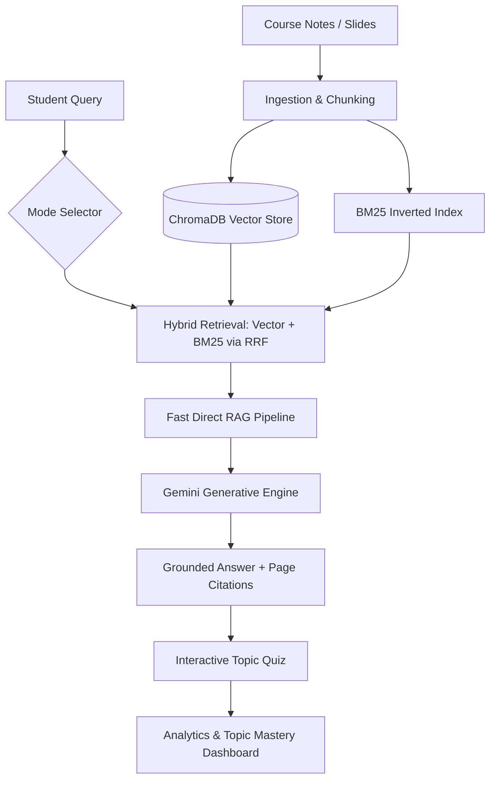
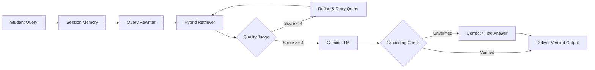

# StudySync AI — Academic Intelligence Platform

[](https://www.python.org/)
[](https://fastapi.tiangolo.com/)
[](https://ai.google.dev/)
[](https://www.trychroma.com/)
[](LICENSE)

StudySync AI is a full-stack, production-grade Academic Intelligence and Agentic Retrieval-Augmented Generation (RAG) platform. Designed for students, researchers, and educators, it turns course syllabi, lecture slides, and textbook notes into a private, grounded knowledge base with mathematical formula rendering, vision OCR extraction, customized explanation modes, and real-time mastery analytics.

---

## Key Features

### 1. Hybrid & Grounded RAG Pipeline
- **Hybrid Retrieval**: Combines semantic vector embeddings (`sentence-transformers/all-MiniLM-L6-v2` via ChromaDB) with lexical keyword matching (BM25) using Reciprocal Rank Fusion (RRF).
- **Fast Direct & Multi-Stage Agentic Modes**: Standard queries resolve via optimized single-turn RAG for sub-second responses, while complex multi-part queries trigger query rewriting, retrieval judging, and grounding verification.
- **Strict Hallucination Control**: Responses cite exact source document filenames and page numbers. Unverified claims are automatically flagged or corrected.
- **Session Conversation Memory**: Preserves context across multi-turn exchanges for contextual follow-up questions.

### 2. Multi-Tier Optical Character Recognition (OCR)
- **Computer Vision Extraction**: Ingests textbook photos, handwritten equations, diagrams, and slide snapshots.
- **Adaptive Fallback**: High-performance local extraction powered by OpenCV and Tesseract OCR, with automatic fallback to Google Gemini Vision for handwritten math and degraded scans.
- **Direct Integration**: Extracted text can be immediately copied into query prompts or indexed directly into the active knowledge base.

### 3. Adaptive Pedagogical Modes
- **General**: Balanced, clear conceptual breakdown for everyday study.
- **Beginner**: Relatable everyday analogies and plain language explanations.
- **Exam Prep**: High-yield summaries, key formulas, core theorems, and common pitfalls.
- **Technical**: Rigorous mathematical breakdowns with standard LaTeX notation.
- **Bilingual Support**: Instant generation in English and Hindi.

### 4. Automated Knowledge Testing
- **Dynamic Quiz Generator**: Automatically synthesizes multiple-choice and short-answer questions tailored strictly to the current study topic.
- **Instant Validation & Feedback**: Provides immediate scoring with detailed pedagogical explanations for both correct and incorrect options.

### 5. Focus & Attention Mode
- **Real-Time Webcam Monitor**: Evaluates student posture and presence using OpenCV facial detection algorithms.
- **Distraction Alerts**: Tracks study focus duration and reports session engagement metrics.

### 6. Topic Mastery & Analytics Dashboard
- **Learning Progression Tracking**: Persists question history, quiz assessments, topic-level mastery percentages, and engagement frequency.
- **Visual Analytics**: Interactive topic mastery bars and chronological study activity feeds.

---

## Technical Stack

| Domain | Technology | Description |
|---|---|---|
| **Backend Framework** | FastAPI, Uvicorn | Asynchronous Python REST API engine |
| **LLM & Vision** | Google Gemini (1.5 Flash, 2.5 Flash, 1.5 Pro) | Primary reasoning, summarization, and vision extraction |
| **Vector Database** | ChromaDB | Local persistent vector index with cosine similarity |
| **Lexical Search** | rank_bm25 | Token-level BM25 search for precise term retrieval |
| **Embeddings** | HuggingFace `all-MiniLM-L6-v2` | Dense sentence representations |
| **Document Processing** | pypdf, pdf2image, Pillow | PDF parsing, chunking, and rasterization |
| **Vision & Video** | OpenCV (cv2), Tesseract OCR | Image filtering, adaptive binarization, and face detection |
| **Frontend UI** | HTML5, Modern Vanilla CSS3, ES6 JavaScript | Glassmorphic dark aesthetic, zero heavy frontend build dependencies |
| **Formula & Markdown** | MathJax 3, Marked.js | Native LaTeX rendering (`$E=mc^2$`) and structured markdown |

---

## System Architecture

### Smart Learning Workflow



### Agentic Retrieval & Verification Pipeline



---

## Project Structure

```
AI-TUTOR-main/
│
├── backend/                        # Application backend modules
│   ├── agents/                     # Specialized agentic workflows
│   │   ├── grounding_checker.py    # Factuality and hallucination verification
│   │   ├── memory.py               # Session-scoped conversation memory
│   │   ├── query_rewriter.py       # Query expansion and sub-query decomposition
│   │   └── retrieval_judge.py      # Relevance scoring and retrieval retry engine
│   ├── analytics/                  # Learning metrics and analytics engine
│   │   └── progress_tracker.py     # Topic mastery calculations and activity storage
│   ├── services/                   # High-level core business services
│   │   └── attention_tracker.py    # OpenCV facial detection and focus analytics
│   ├── utils/                      # Helper libraries and low-level tools
│   │   ├── image_processing.py     # Image filters and deskewing routines
│   │   └── ocr_engine.py           # Dual-tier Tesseract and Gemini Vision OCR
│   ├── app.py                      # FastAPI endpoint declarations and route handlers
│   └── llm_manager.py              # Multi-tier Google Gemini model manager
│
├── frontend/                       # Client web interface
│   ├── index.html                  # Semantic single-page application structure
│   ├── styles.css                  # Bespoke glassmorphism design system & tokens
│   └── app.js                      # Client state management, API calls, and MathJax
│
├── scripts/                        # Core algorithmic pipelines
│   ├── build_db.py                 # PDF chunking, embedding generation, ChromaDB indexing
│   ├── bm25_retriever.py           # In-memory BM25 lexical search implementation
│   ├── hybrid_retriever.py         # Reciprocal Rank Fusion (RRF) rank combiner
│   ├── prompt_modes.py             # Domain prompt templates for pedagogical modes
│   └── query_data.py               # Orchestrator for RAG execution
│
├── tests/                          # Automated verification suite
│   ├── test_agents.py              # Unit tests for query rewriter, judge, and checker
│   ├── test_ingestion.py           # PDF parsing and chunking unit tests
│   ├── test_ocr.py                 # OCR engine unit tests
│   └── test_rag.py                 # End-to-end question answering tests
│
├── .env.example                    # Environment variable specification template
├── .gitignore                      # Git exclusion rules
├── Dockerfile                      # Container specification for Cloud / Spaces deployment
├── requirements.txt                # Pinned production Python dependencies
├── run.py                          # Unified development server launcher
└── vercel.json                     # Frontend static hosting configuration
```

---

## Getting Started

### Prerequisites
- **Python 3.10** or higher
- **Google Gemini API Key** (available free from [Google AI Studio](https://aistudio.google.com/))
- **Tesseract OCR** (optional, recommended for local image text extraction)
  - Windows: `winget install UB-Mannheim.TesseractOCR`
  - macOS: `brew install tesseract`
  - Linux: `sudo apt-get install tesseract-ocr`
- **Poppler** (optional, for processing scanned PDF documents)
  - Windows: `winget install osdn.poppler` or via conda
  - macOS: `brew install poppler`
  - Linux: `sudo apt-get install poppler-utils`

### Installation

1. **Clone the Repository**:
   ```bash
   git clone https://github.com/subarnasural/StudySync-AI.git
   cd StudySync-AI
   ```

2. **Create and Activate a Virtual Environment**:
   ```bash
   # Windows (PowerShell)
   python -m venv .venv
   .\.venv\Scripts\Activate.ps1

   # macOS / Linux
   python3 -m venv .venv
   source .venv/bin/activate
   ```

3. **Install Dependencies**:
   ```bash
   pip install --upgrade pip
   pip install -r requirements.txt
   ```

4. **Configure Environment Variables**:
   Copy `.env.example` to `.env`:
   ```bash
   cp .env.example .env
   ```
   Open `.env` and set your API keys:
   ```env
   GEMINI_API_KEYS="your-gemini-api-key-here"
   CHROMA_PERSIST_DIR="chroma"
   PORT=8000
   ```

---

## Running the Application

Launch the unified backend server and frontend client:
```bash
python run.py
```

Once started:
- **Interactive Web Interface**: Open `http://127.0.0.1:8000/static/index.html` in your browser.
- **Interactive OpenAPI Documentation**: Available at `http://127.0.0.1:8000/docs`.

---

## API Reference

| Method | Route | Description |
|---|---|---|
| `POST` | `/upload/` | Upload course documents (`.pdf`, `.png`, `.jpg`) |
| `POST` | `/build/` | Process files, chunk text, and build vector/BM25 indices |
| `GET` | `/files/` | List currently indexed course materials |
| `POST` | `/chat/` | Submit a student query with selected mode and language |
| `POST` | `/ocr/` | Extract textual content from uploaded image |
| `POST` | `/quiz/` | Generate topic-grounded evaluation questions |
| `POST` | `/quiz/score/` | Submit quiz answers and record student score |
| `GET` | `/dashboard/` | Retrieve topic mastery percentages and recent activities |
| `POST` | `/reset/` | Wipe index, database, uploaded files, and study stats |

---

## Automated Testing

Run the full automated test suite covering ingestion, retrieval, OCR, and agents:

```bash
python -m pytest tests/ -v
```

---

## Deployment

### Full-Stack Local Deployment
Run `python run.py` for a fully self-contained local deployment with local ChromaDB persistence.

### Cloud Split Deployment (Vercel + Cloud Backend)
- **Frontend**: Deploy the `frontend/` directory directly to Vercel (configured via `vercel.json`).
- **Backend**: Containerize the root using the included `Dockerfile` and deploy to Hugging Face Spaces, Render, or Google Cloud Run. Set the `CLOUD_BACKEND_URL` in `frontend/app.js` to point to the remote API.

---

## License
Developed as part of an Academic Intelligence & Final Year Project (FYP). Distributed under the MIT Academic License.
